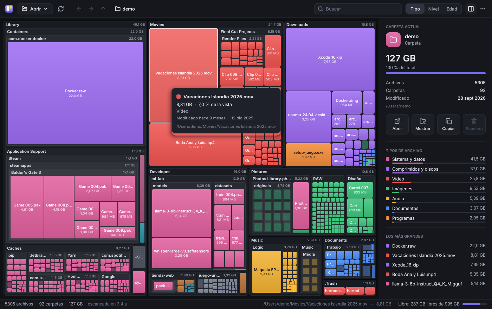
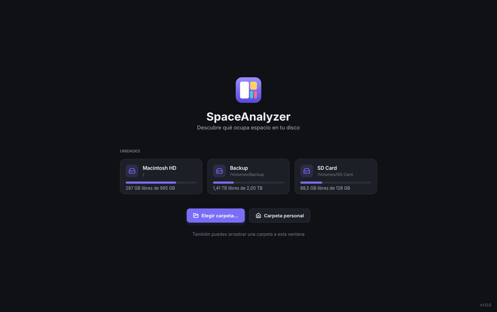
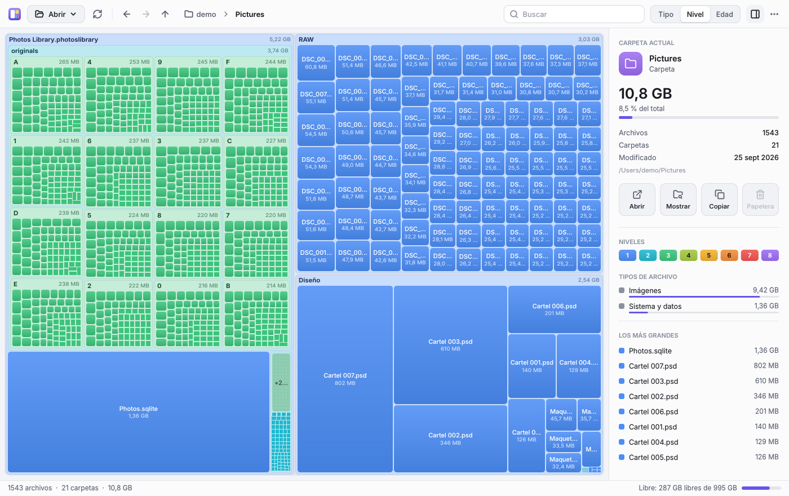

<p align="center"></p>

<h1 align="center">SpaceAnalyzer</h1>

<p align="center">
  <a href="https://github.com/aurgo/SpaceAnalyzer/actions/workflows/ci.yml"></a>
</p>

<p align="center">
  <b>Descubre qué ocupa espacio en tu disco.</b><br>
  Un visualizador de espacio en disco moderno, inspirado en el clásico SpaceMonger,<br>
  en <b>un único ejecutable de ~2 MB</b>: sin instalación y sin frameworks de interfaz.
</p>

<p align="center">
  <a href="https://aurgo.github.io/SpaceAnalyzer/"><b>Web</b></a> ·
  <a href="https://github.com/aurgo/SpaceAnalyzer/releases/latest"><b>Descargar</b></a> ·
  <a href="https://aurgo.github.io/SpaceAnalyzer/en/">English</a>
</p>



## Descargar

Descarga el archivo de tu sistema de la [última versión](https://github.com/aurgo/SpaceAnalyzer/releases/latest). No hay nada que instalar:

| Sistema | Descarga |
|---|---|
| Windows 10/11 | [x64](https://github.com/aurgo/SpaceAnalyzer/releases/latest/download/SpaceAnalyzer-windows-x64.exe) · [ARM64](https://github.com/aurgo/SpaceAnalyzer/releases/latest/download/SpaceAnalyzer-windows-arm64.exe) |
| macOS 12+ (Apple Silicon e Intel) | [App universal](https://github.com/aurgo/SpaceAnalyzer/releases/latest/download/SpaceAnalyzer-macos.zip) |
| Linux (X11 o XWayland) | [x64](https://github.com/aurgo/SpaceAnalyzer/releases/latest/download/SpaceAnalyzer-linux-x64.tar.gz) · [ARM64](https://github.com/aurgo/SpaceAnalyzer/releases/latest/download/SpaceAnalyzer-linux-arm64.tar.gz) |

Windows y macOS avisan la primera vez porque los ejecutables no están firmados con un certificado de pago. En la [página de la versión](https://github.com/aurgo/SpaceAnalyzer/releases/latest) se explica cómo abrirlos. También hay versiones *mini*, de unos 500 KB, para quien ya tiene instalado .NET 10.

## Características

- **Treemap anidado**, como SpaceMonger: cada carpeta es un bloque con su nombre y su tamaño, y dentro están sus archivos y subcarpetas en proporción a lo que ocupan. Usa el algoritmo *squarified*, que da bloques casi cuadrados, fáciles de comparar y de pulsar.
- **Zoom**: doble clic para entrar en una carpeta (con animación), y rueda del ratón, pellizco o <kbd>Retroceso</kbd> para salir. Tiene migas de pan y los botones atrás, adelante y subir.
- **Tres formas de colorear**:
  - por **tipo** de archivo (vídeo, imágenes, audio, documentos, comprimidos, código, programas, datos);
  - por **nivel** de carpeta, el aspecto clásico de SpaceMonger;
  - por **antigüedad**, como mapa de calor: lo que no tocas desde hace años sale en frío.
- **Panel lateral** con los detalles de la selección, el desglose por tipo (haz clic en un tipo para resaltarlo en el mapa) y los archivos más grandes.
- **Búsqueda** por nombre, que resalta las coincidencias en el mapa. Basta con empezar a escribir.
- **Acciones**: abrir, mostrar en Finder o en el Explorador, copiar la ruta, enviar a la papelera (con confirmación; el mapa se actualiza sin volver a escanear) y volver a escanear una subcarpeta.
- Muestra el **espacio libre** de la unidad como un bloque más. Tiene niveles de detalle, tema claro, oscuro o del sistema, y está en español e inglés.
- **Escaneo multihilo** con progreso en vivo. No sigue enlaces simbólicos ni entra en otros volúmenes, así que nada se cuenta dos veces. Usa el tamaño real en disco de los archivos dispersos, comprimidos o en la nube.
- **Preguntar a la IA qué borrar**: el botón ✨ copia un prompt con lo que más ocupa (rutas, tamaños y fechas) para pegarlo en el chat de la IA que uses. Con clic derecho, la pregunta es sobre ese archivo o carpeta. La app no lo envía a ningún sitio.
- **Se actualiza sola**: al abrirse, como mucho una vez al día, le pregunta a GitHub cuál es la última versión. Si hay una nueva, la descarga, comprueba su SHA-256 contra el `SHA256SUMS.txt` de la versión y se sustituye a sí misma; un botón **Reiniciar para usar…** la abre al momento, y si no, se usa la próxima vez. Se desactiva en el menú ⋯ con *Actualizar automáticamente*, y también se puede actualizar a mano desde «Acerca de». Si no puede sustituirse (por ejemplo, en una carpeta sin permiso de escritura o con las versiones *mini* de macOS y Linux), muestra un botón **Nueva versión** que abre su página de descarga. Es lo único para lo que la app se conecta a Internet: nunca envía nada de tus archivos.

| Inicio | Modo clásico (colores por nivel), tema claro |
|---|---|
|  |  |

## Un único archivo, de verdad

- **Un solo ejecutable**: sin instalador, sin DLL al lado y sin paquetes NuGet. No usa WinForms, WPF, Avalonia ni MAUI.
- **Todo se dibuja en C#**:
  - un rasterizador propio, con formas suavizadas, degradados y sombras;
  - la fuente **[Inter](https://rsms.me/inter/)** incrustada (unos 20 KB por grosor; la convierte [`tools/FontBaker.cs`](tools/FontBaker.cs));
  - iconos vectoriales.

  El resultado son los mismos píxeles en todos los sistemas.
- **Capa mínima por sistema operativo**. Es lo único que depende de cada sistema: abre la ventana, recibe el ratón y el teclado, copia la imagen a la pantalla y usa los servicios del sistema (papelera, abrir archivos, selector de carpetas, portapapeles y la conexión HTTPS para buscar actualizaciones, así el ejecutable no carga con una pila de red propia).
  - Windows: Win32
  - macOS: AppKit
  - Linux: X11

| Plataforma | Estado | Un archivo (con .NET 10) | Nativo AOT (sin dependencias) |
|---|---|---|---|
| Windows 10/11 (x64, ARM64) | ✅ Funcional | ~530 KB | ~2,0 MB |
| macOS (Apple Silicon e Intel) | ✅ Funcional | ~480 KB | ~2,3 MB |
| Linux (X11 y XWayland) | ✅ Funcional | ~430 KB | ~3,0 MB |

La interfaz en sí, con el dibujo, la disposición, el ratón y el teclado, es el mismo código en todos los sistemas.

La [integración continua](.github/workflows/ci.yml) hace esto en cada cambio:
- Pasa las pruebas en los tres sistemas y compila los ejecutables.
- **Abre la app de verdad** en Windows y en Linux (con un servidor X virtual).
- Mueve el ratón, hace doble clic, escribe una búsqueda y abre el menú contextual.
- Guarda una captura en cada paso.

Los ejecutables y las capturas quedan como *artifacts* de cada ejecución.

## Compilar y ejecutar

Necesitas el [SDK de .NET 10](https://dotnet.microsoft.com/download).

```bash
dotnet run --project src/SpaceAnalyzer            # abre la ventana
dotnet run --project src/SpaceAnalyzer -- ~/Downloads   # y analiza una carpeta directamente
```

Para generar el ejecutable único, elige una plataforma: `win-x64`, `win-arm64`, `osx-arm64`, `osx-x64`, `linux-x64` o `linux-arm64`. Este ejecutable necesita tener instalado el runtime de .NET 10:

```bash
dotnet publish src/SpaceAnalyzer -c Release -r win-x64
```

Si prefieres un ejecutable nativo, sin ninguna dependencia (pesa unos pocos MB), compílalo en el mismo sistema en el que lo vas a usar:

```bash
dotnet publish src/SpaceAnalyzer -c Release -r win-x64 -p:PublishAot=true
```

También hay scripts de ayuda:

```bash
./build/publish.sh        # ejecutables para todas las plataformas, en artifacts/
./build/macos-app.sh      # SpaceAnalyzer.app con su icono (macOS)
dotnet test               # pruebas automáticas
dotnet run tools/SiteGen.cs   # regenera la web (docs/) a partir de site/index.html
```

Al subir una etiqueta `v*`, el flujo [Release](.github/workflows/release.yml) compila los ejecutables nativos de cada sistema y publica la versión. También se puede publicar desde GitHub, sin etiqueta: **Actions → Release → Run workflow** con *publish* marcado crea la etiqueta `v` + la versión de `Directory.Build.props`. Antes de publicar hay que subir esa versión, y la etiqueta tiene que coincidir con ella.

El `.exe` de Windows también se puede generar desde macOS o Linux. Solo hay una diferencia: el icono del archivo y el manifiesto se incrustan únicamente al compilar en Windows. Aun así, la ventana siempre muestra su icono.

## Uso

| Acción | Ratón | Teclado |
|---|---|---|
| Seleccionar | Clic | Flechas |
| Entrar en una carpeta | Doble clic, rueda hacia delante | <kbd>Intro</kbd> |
| Subir un nivel | Rueda hacia atrás, clic central | <kbd>Retroceso</kbd> (Win), <kbd>⌘↑</kbd> (Mac) |
| Atrás / adelante | Botones laterales del ratón | <kbd>Alt+←/→</kbd> (Win), <kbd>⌘[</kbd> / <kbd>⌘]</kbd> (Mac) |
| Menú contextual | Clic derecho | |
| Buscar | | Empieza a escribir, o <kbd>Ctrl/⌘+F</kbd> |
| Copiar la ruta | | <kbd>Ctrl/⌘+C</kbd> |
| Enviar a la papelera | | <kbd>Supr</kbd> (Win), <kbd>⌘⌫</kbd> (Mac) |
| Colorear por tipo, nivel o antigüedad | Botones de la barra | <kbd>Ctrl/⌘+1</kbd>, <kbd>2</kbd>, <kbd>3</kbd> |
| Volver a escanear | | <kbd>F5</kbd>, <kbd>⌘R</kbd> |

También puedes arrastrar una carpeta a la ventana.

## Capturas sin ventana

El programa puede renderizar su interfaz a PNG sin abrir ninguna ventana, en cualquier sistema. Es útil para revisar el diseño; así se han hecho las capturas de este README:

```bash
SpaceAnalyzer --snapshot salida.png --demo --size 1400x880 --scale 2 --theme light --mode depth
SpaceAnalyzer --snapshot salida.png ~/Downloads     # con una carpeta real
```

La opción `--demo` usa una carpeta personal inventada, así que en las capturas no aparece ningún dato tuyo.

## Estructura del código

```
src/SpaceAnalyzer/
  Core/       escaneo, árbol de archivos, algoritmo squarified, formatos (sin interfaz)
  Render/     rasterizador, motor de texto, fuente Inter incrustada, PNG
  UI/         toda la interfaz, independiente del sistema operativo
  Platform/   capas mínimas: Windows (Win32), MacOS (AppKit), Linux (X11)
tests/SpaceAnalyzer.Tests/   pruebas: escaneo, algoritmo, dibujo, texto e interfaz sin ventana
tools/
  FontBaker.cs   convierte una fuente TTF al formato compacto .saf
  SiteGen.cs     genera la web en español e inglés a partir de la plantilla
site/            plantilla bilingüe de la web (SEO, datos estructurados y herramientas WebMCP)
docs/            la web publicada en GitHub Pages y las imágenes de este README
build/           scripts de publicación
```

## Licencia

[MIT](LICENSE) © 2026 Armando.

Incluye la fuente Inter (SIL Open Font License 1.1) e iconos basados en Lucide (ISC). Los avisos completos están en [THIRD-PARTY-NOTICES.md](THIRD-PARTY-NOTICES.md).

---

### In English

**SpaceAnalyzer** is a modern disk space visualizer inspired by the classic SpaceMonger, in **one ~2 MB executable** (~500 KB if you already have .NET 10). It shows a nested *squarified* treemap that you can zoom, color by file type, folder depth or age, search, and use to open files or move them to the trash. *Ask AI* copies a prompt with the largest items, to paste into any AI chat. It updates itself: at start, at most once a day, it asks GitHub for the latest version, and when there is a newer one it downloads it, checks its SHA-256 and replaces itself (turn it off in the ⋯ menu with *Update automatically*). That is the only thing it goes online for; nothing about your files is ever sent.

**[Website](https://aurgo.github.io/SpaceAnalyzer/en/)** · **[Download](https://github.com/aurgo/SpaceAnalyzer/releases/latest)** for Windows (x64, ARM64), macOS (Apple Silicon and Intel) or Linux (x64, ARM64). There is nothing to install.

There is no UI framework. Everything, including shapes, text with the embedded Inter font, and icons, is drawn by a small software renderer written in C#. Each operating system only needs a thin layer that opens the window and forwards input: Win32, AppKit or X11.

It works on Windows, macOS and Linux. CI launches the real app on Windows and on Linux (Xvfb), drives it with the mouse and keyboard, and saves screenshots.

Build it with `dotnet publish src/SpaceAnalyzer -c Release -r <rid>`.
